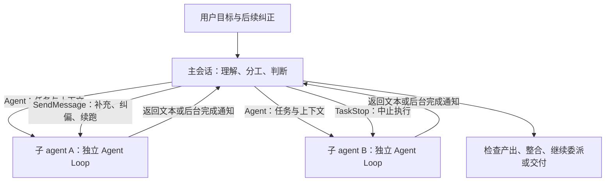
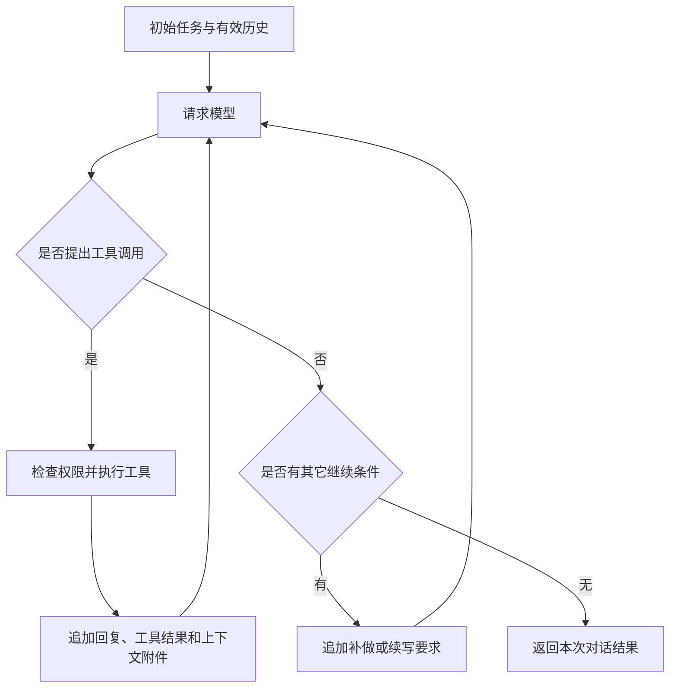

# Claude Code Agent 机制：对话循环与主从协作

Claude Code 的 Agent 机制包含两个相互衔接的层次：单个 agent 内部通过模型请求和工具反馈完成工作；主会话通过委派、消息和结果回收组织多个 agent，共同推进用户目标。

主模型决定如何理解需求、划分工作和判断产出；子 agent 在各自的上下文里执行任务；运行时负责模型请求、工具执行、权限、消息路由、取消和资源清理。运行时能够记录执行状态，但不会默认证明所有自然语言需求都已满足。

本文以本仓库保留的 Claude Code 原生 `Agent`、`query()` 和 Agent Teams 链路为依据，覆盖任务派发、身份与消息路由、上下文、前后台执行、干预、结果回收、恢复和目标对齐。项目自定义的任务编排不在本文范围内。模型协议兼容层单独放在附录中。

实现基线：`14c8b49`；官方文档核对日期：2026-10-08。源码中的特性开关、构建条件和权限配置会影响具体行为；本文的实现描述不代表每个官方发行版都采用完全相同的默认值。

## 1. 会话、Agent 与任务的关系

### 1.1 三个不同的对象

| 对象 | 含义 | 主要职责 |
| --- | --- | --- |
| 主会话 | 用户持续交互的会话，保存需求、决策和主会话历史 | 理解总目标、委派工作、处理反馈、整合和交付 |
| 子 agent | 主会话或其它允许的调用方启动的一段独立工作 | 根据任务输入，运行自己的模型与工具循环 |
| 任务记录 | 对工作内容或运行状态的描述 | 跟踪进度、归属、依赖或执行生命周期 |

“任务记录”还需要区分两种：

- `TaskCreate` / `TaskUpdate` 管理工作清单，状态为 `pending`、`in_progress`、`completed`，可包含负责人和依赖。
- 后台执行器管理运行任务，普通本地子 agent 对应 `local_agent`，状态包含 `running`、`completed`、`failed`、`killed`。

创建清单记录不会自动启动子 agent；把清单状态改为完成也不会自动停止正在工作的 agent。`Agent` 工具的旧名称是 `Task`，这与 `TaskCreate` 创建工作清单是不同的操作。

源码：[Agent/constants.ts](../src/tools/AgentTool/constants.ts)、[TaskCreateTool.ts](../src/tools/TaskCreateTool/TaskCreateTool.ts)、[tasks.ts](../src/utils/tasks.ts)、[LocalAgentTask.tsx](../src/tasks/LocalAgentTask/LocalAgentTask.tsx)。

### 1.2 普通子 Agent、Fork 与 Teammate

| 形式 | 启动时的对话上下文 | 工作结束后的主要行为 |
| --- | --- | --- |
| 普通专业 subagent | 自己的系统提示词、委派消息和按配置加载的上下文 | 将最终文本交回调用方 |
| fork subagent | 启动时复制父会话历史，并沿用父会话的系统提示词、模型和工具配置 | 自己后续的工具历史保持独立，最终文本交回调用方 |
| Agent Teams teammate | 以团队成员身份运行，持有自己的会话上下文 | 可以完成一轮后进入 idle，等待消息或下一项工作 |

fork 复制的是启动时的上下文，不是与父会话实时共享同一份历史。父会话后续收到的用户消息、其它 agent 的发现和新决策，需要另行传达。

在本仓库中，fork 路径仅在 `FORK_SUBAGENT` 构建特性启用、处于交互会话且不是 coordinator 时生效：生效时，省略 `subagent_type` 进入 fork 路径；否则省略该字段默认选择 `general-purpose`。团队派发还有独立条件：Agent Teams 启用，存在有效团队上下文或 `team_name`，同时提供 `name`，才会进入 teammate 的创建路径。给普通后台 subagent 命名也可以只是为了让它能通过 `SendMessage` 寻址。

源码：[AgentTool.tsx](../src/tools/AgentTool/AgentTool.tsx)、[forkSubagent.ts](../src/tools/AgentTool/forkSubagent.ts)、[spawnMultiAgent.ts](../src/tools/shared/spawnMultiAgent.ts)。产品概念参见 [官方：Subagents](https://code.claude.com/docs/en/sub-agents) 与 [官方：Agent Teams](https://code.claude.com/docs/en/agent-teams)。

### 1.3 角色、实例、调用和任务各用什么标识

主会话区分子 agent，靠的是运行时生成的实例身份和调用关联，不是靠报告正文自报姓名，也不是按启动或完成顺序猜测。

| 字段 | 标识什么 | 是否可以直接作为消息收件人 |
| --- | --- | --- |
| `subagent_type` | agent 的角色定义，如 `general-purpose` | 不能仅凭角色类型定位一个实例 |
| `description` | 本次工作的显示说明 | 不用于寻址 |
| 普通子 agent 的 `agentId` | 某个具体实例，新建时生成，恢复时沿用 | 可以作为 `SendMessage.to` |
| 普通子 agent 的 `name` | 已注册时，作为实例 ID 的可读别名 | 可以，但必须是注册表中的实际名称 |
| `tool_use.id` / `tool_result.tool_use_id` | 一次具体的工具调用及其返回 | 用于关联调用，不是收件地址 |
| 运行任务的 `task_id` | 运行时跟踪、停止或读取输出的任务 | 普通 `local_agent` 中等于 `agentId`；不能推广到其它任务类型 |
| `TaskCreate` 的任务 ID | 工作清单中的一个工作项，如任务 `#3` | 不是 agent 或运行任务地址 |
| 团队的 `agentName`、`teamName` | 当前团队中的成员名称及其命名空间 | `SendMessage.to` 使用成员实际名称 |
| 团队成员的完整 `agentId` | 形如 `researcher@auth-team` 的成员身份 | 本仓库的 `SendMessage.to` 拒绝含 `@` 的地址，应使用成员名称 |

同一个角色可以启动多个实例；相同的角色、模型或显示说明不会使实例合并。工具调用 ID 标识某次启动或续跑操作，agent ID 标识持续使用的实例，二者也不能互相替代。

源码：[uuid.ts](../src/utils/uuid.ts)、[ids.ts](../src/types/ids.ts)、[AgentTool.tsx](../src/tools/AgentTool/AgentTool.tsx)、[LocalAgentTask.tsx](../src/tasks/LocalAgentTask/LocalAgentTask.tsx)、[agentId.ts](../src/utils/agentId.ts)、[SendMessageTool.ts](../src/tools/SendMessageTool/SendMessageTool.ts)。

## 2. 主会话与子 Agent 共用的对话引擎

主会话和同进程 API 子 agent 最终都进入 `query()`：

```text
用户输入
  └─ REPL / QueryEngine ──────────────────────┐
                                              │
主模型调用 Agent                              ├─ query → queryLoop
  └─ AgentTool → runAgent ────────────────────┘     └─ 请求模型、执行工具、回填结果、继续或结束
```

子 agent 不是主模型在一条回答中模拟出来的几个角色。每个子 agent 有自己的消息历史、模型请求、工具执行上下文和记录，主会话只在规定的通信边界获取结果。

`runAgent()` 接收任务和配置，准备 agent ID、系统提示词、初始历史、工具、权限、取消信号及记录位置，再调用 `query()`。原生同进程 teammate 的一次工作也复用这个入口，但在其外面还有等待消息、领取任务和退出的生命周期循环。



图中是普通子 agent 的主从关系；teammate 的消息和 idle 生命周期见第 12 节。

源码：[REPL.tsx](../src/screens/REPL.tsx)、[QueryEngine.ts](../src/QueryEngine.ts)、[runAgent.ts](../src/tools/AgentTool/runAgent.ts)、[inProcessRunner.ts](../src/utils/swarm/inProcessRunner.ts)。另起 CLI 进程的项目扩展执行器不属于上述同进程调用链。

## 3. 单个 Agent 怎样启动并建立上下文

### 3.1 任务输入与运行配置

启动一个子 agent，调用方需要提供任务，并选择或继承相应配置：

- 目标及其原因、已知事实、工作范围和限制；
- 可以检查的完成条件、需要返回的证据和未完成项；
- agent 定义、模型、工具、权限及工作目录。

例如：

> 检查登录请求偶发失败的原因。已知失败集中在 token 刷新后，网络请求本身能成功。只研究认证模块，先不要修改文件。返回调用路径、支持结论的代码位置，以及尚未验证的假设。

这些要求描述要完成的工作，不预先规定“API 1 必须读文件、API 2 必须搜索”。具体工具顺序由子模型根据任务和反馈决定。

### 3.2 系统提示词与委派消息

普通专业 subagent 的系统提示词来自 agent 定义，并由运行时补充环境信息；本次 `prompt` 则包装为初始 user 消息。系统提示词规定角色和工作方式，委派消息规定这次要做什么。

按配置，运行时还会加载用户上下文、项目规则、agent 指定的 skills、MCP 和 `SubagentStart` hook 提供的额外上下文。不能据此认为每个子 agent 都获得所有父会话内容：例如 `omitClaudeMd` 可影响规则加载，Explore 和 Plan 的系统上下文会省略 git 状态。

因此，界面上的委派文本不是一次模型请求的全部输入；但主会话已经读过的文件、已经形成的判断，也不会自动全部出现在普通新建子 agent 的历史里。

### 3.3 新建、Fork 与恢复的差别

| 路径 | 初始历史的来源 |
| --- | --- |
| 新建普通 subagent | 本次委派消息，加上运行时按配置注入的上下文 |
| 新建 fork | 父会话启动快照，加上本次工作指令 |
| 恢复已有 agent | 原 agent 的独立 transcript，加上新消息 |

`runAgent()` 将调用方提供的 `forkContextMessages` 与本次 `promptMessages` 合成初始历史：普通新建子 agent 不传这部分，fork 传父会话快照，同进程 teammate 连续工作时传自己的既有历史。恢复路径则先读取原 transcript，再追加新消息。

使用相同的 agent 定义，只表示角色配置相同，不表示自动续接它上一次工作的聊天记录。

源码：[AgentTool.tsx](../src/tools/AgentTool/AgentTool.tsx)、[runAgent.ts](../src/tools/AgentTool/runAgent.ts)、[resumeAgent.ts](../src/tools/AgentTool/resumeAgent.ts)。参见 [官方：子 Agent 启动上下文](https://code.claude.com/docs/en/sub-agents#what-loads-at-startup)。

### 3.4 上下文隔离与文件隔离

独立对话历史不等于独立文件系统。默认共享工作目录时，不同 agent 可以读写同一批文件：文件变化可能被另一个 agent 看到，但修改原因、接口约定和后续计划不会因此自动同步。

`isolation: "worktree"` 为子 agent 提供独立的 Git 工作区。它隔离文件修改，不能自动解决两个任务在接口、方案或业务目标上的矛盾。并行分工仍需要明确文件范围和交付契约。

## 4. 每次模型 API 请求携带什么

### 4.1 请求的四部分

概念上，每轮请求由以下内容组成：

```text
模型及生成参数
+ 系统提示词、环境与规则
+ 当前可用工具的定义
+ 当前有效对话历史
```

- 工具定义包含名称、用途和参数结构，不是把工具实现源码发给模型。
- 历史包含初始任务、模型此前的回复、工具调用及其结果。
- 文件和命令输出通常通过工具结果进入历史，不是默认上传整个工作区。
- 工具发现、上下文注入和权限配置等可以影响实际请求内容。

本项目在 [claude.ts](../src/services/api/claude.ts) 的 `paramsFromContext()` 中构造请求参数，再由相应模型 API 客户端或协议转换层发送。

### 4.2 连续四次调用的例子

假设 `U` 是初始任务，`A1` 是模型回复，`T1` 是该回复所要求的工具返回结果。每行还携带系统提示词、工具定义和模型参数，表中省略。

| 请求 | 传入的历史 | 模型本次提出的动作或答案 |
| --- | --- | --- |
| API 1 | `U` | `A1`：调用 `Read` 读取相关文件 |
| API 2 | `U + A1 + T1` | `A2`：根据文件内容调用 `Edit` |
| API 3 | `U + A1 + T1 + A2 + T2` | `A3`：调用 `Bash` 运行测试 |
| API 4 | `U + A1 + T1 + A2 + T2 + A3 + T3` | `A4`：汇总修改和测试结果，不再调用工具 |

如果 `T3` 显示测试失败，API 4 也可能要求继续检查、修改和测试。工具输出本身就是反馈，不一定需要人再补一句“测试失败，请继续”。

工具调用和结果通过调用 ID 配对。不能只保留结果、丢掉相应调用，否则模型无法按协议理解哪个结果对应哪个动作。

### 4.3 历史由本地循环管理

`query.ts` 构造下一轮状态时，核心关系是：

```text
下一轮历史 = 当前有效历史 + 本轮 assistant 消息 + 本轮工具结果及上下文附件
```

对应变量包括 `messagesForQuery`、`assistantMessages` 和 `toolResults`。有效历史可以经过规范化、过大工具结果处理和压缩，并不意味着每次原样携带所有旧内容。压缩等辅助机制也可能产生额外模型请求。

主会话和子 agent 分别维护自己的有效历史。子 agent 的完整工具轨迹不会因为它结束就自动拼进主会话。

## 5. 什么时间点发下一次模型请求

### 5.1 工具反馈驱动下一轮

正常的客户端工具路径是：

1. 消费本轮模型响应，收集正文和结构化工具调用。
2. 发现 `tool_use` 时，将 `needsFollowUp` 设为 `true`。
3. 执行本轮工具，收集返回结果。
4. 把模型回复、工具结果及相关上下文加入历史。
5. 更新循环状态，发起下一次模型请求。

这不是定时器驱动，也不是每收到几个 token 就重新请求。下一轮通常由本轮实际工具调用及其反馈触发。实现见 [query.ts](../src/query.ts) 的 `deps.callModel()`、`needsFollowUp` 和下一轮 `state`。



### 5.2 多个工具、流式执行与后台工作

一次模型回复可以提出多个工具调用。执行器允许安全的调用并发，并对需要串行的调用施加相应约束。

启用流式工具执行时，完整工具调用到达后就可能开始执行，此时模型仍在输出本轮其它内容。下一次主循环模型请求仍需要等本轮响应处理完、这批工具返回并完成上下文更新。

工具返回不一定意味着它启动的全部后台工作已经自然结束。例如后台命令或后台子 agent 可以先返回任务 ID，实际结果随后通过通知或读取输出取得。

源码：[StreamingToolExecutor.ts](../src/services/tools/StreamingToolExecutor.ts)、[toolOrchestration.ts](../src/services/tools/toolOrchestration.ts)。

### 5.3 三种数量不能混同

- 一次模型请求可以产生很多流式事件；流式事件数不是请求数。
- 一次模型请求可以提出多个工具调用；工具调用数不是请求数。
- `Read`、`Edit`、`Bash` 通常不是模型推理请求；`Agent` 等会启动另一段模型循环的工具需要另行计数。

以上描述的是客户端执行工具。部分服务端工具可以在单次请求内完成多步操作，不能把客户端往返方式推广到所有工具。参见 [官方：工具调用循环](https://platform.claude.com/docs/en/agents-and-tools/tool-use/how-tool-use-works#the-agentic-loop-client-tools)。

## 6. 单次对话什么时候结束

### 6.1 正常停止条件

正常路径中，本轮响应处理完，没有新的工具调用，也没有其它机制要求继续，本次 `query()` 就可以返回。

代码主要根据实际收到的 `tool_use` 设置 `needsFollowUp`，不会扫描正文中的“完成了”，也不只依赖 API 的 `stop_reason`。

| 模型回复 | 通常的后续行为 |
| --- | --- |
| “我先读取文件”，同时带有 `Read` 调用 | 执行工具，携带结果进入下一轮 |
| 只说“我先读取文件”，没有工具调用 | 若无其它继续条件，本次对话会结束 |
| 最终报告，没有工具调用 | 进入停止检查，允许停止时返回 |
| 看似最终报告，但仍附带工具调用 | 先完成工具，再进入下一轮 |

### 6.2 没有工具调用，也可能继续

停止 hook 可以返回阻断反馈，要求补做；输出截断可以触发续写；启用的预算续跑等机制也可以加入继续指令。它们将新信息放入上下文，重新请求模型。

子 agent 对应的停止事件是 `SubagentStop`。这是可配置的检查入口，不是默认针对所有任务实现的业务验收器。

源码：[query.ts](../src/query.ts)、[stopHooks.ts](../src/query/stopHooks.ts)、[hooks.ts](../src/utils/hooks.ts)。

### 6.3 限制与异常也可以终止运行

取消、API 故障、上下文或输出限制，以及配置的 `maxTurns` 等都会影响运行。`runAgent()` 将 `maxTurns ?? agentDefinition.maxTurns` 交给循环，不能假定每个子 agent 都有固定的请求次数。工具循环轮数也不是包含压缩等辅助请求在内的全部模型请求次数。

API 错误、限制触发和中止后的部分文本，都可能经过各自的返回或异常路径。是否结束、运行任务标记什么状态，与最终文本是否足以证明业务完成，需要分别判断。

主会话一次 `query()` 返回也不表示交互程序退出。它仍可以接收下一条用户输入；子 agent 返回后，主模型则可以根据其结果继续调用工具或委派工作。

## 7. 主会话怎样分配任务

### 7.1 分工由主模型决定

主模型通过 `Agent` 工具描述或上下文附件获知可用 agent 的名称、适用场景和工具能力，再决定：

- 哪些工作自己完成，哪些交给子 agent；
- 哪些问题独立，可以同时派发；
- 哪些任务需要先等上游结论，再准备下一份委派；
- 使用普通专业 agent，还是在特性允许时 fork 当前上下文。

这条通用链路没有强制把每个需求拆成固定形状的任务树。模型作出分工决策，运行时按工具参数执行。

### 7.2 一份委派至少交代什么

| 内容 | 需要回答的问题 |
| --- | --- |
| 目标和原因 | 为什么做，结果服务于总目标的哪一部分 |
| 已知背景 | 主会话已确认或排除什么，有哪些前置结论 |
| 工作范围 | 哪些文件、模块、接口由它负责，哪些由其它 agent 负责 |
| 限制 | 是否只研究、是否允许修改、有哪些必须保持的行为 |
| 完成条件 | 用什么检查和证据判断工作完成 |
| 返回要求 | 返回结论、文件位置、测试结果、未完成项中的哪些内容 |

原生工具提示词要求主模型传递足够背景，并明确研究或写代码的预期。普通新建子 agent 不知道用户在主会话中完整表达过什么，因此不能只交一句“照之前讨论的做”。fork 已有启动背景，但仍需要清楚的范围和本次指令。

源码：[prompt.ts](../src/tools/AgentTool/prompt.ts)、[AgentTool.tsx](../src/tools/AgentTool/AgentTool.tsx)。

### 7.3 清单和派发不是一回事

主会话可以用任务清单保存分工和依赖，再调用 `Agent` 启动实际工作。但清单本身不是普通 subagent 的自动执行队列。

如果 B 需要 A 的结论，主会话应等到 A 的有效结果，再把相关结论明确交给 B，或通过消息更新已经启动的 B。单纯把两项工作同时写进清单，不会自动把 A 的结果变成 B 的上下文。

Agent Teams 的自动领取和依赖门控在第 12 节单独说明。

### 7.4 嵌套委派的限制

能否继续创建下一层 agent 取决于当前身份、工具集和特性配置。本仓库的常规子 agent 工具过滤会在 `USER_TYPE` 不是 `ant` 时移除 `Agent` 工具，不能认为普通专业 subagent 都能继续派发。

对于实际持有 `Agent` 工具的同进程 teammate，调用入口只允许同步 subagent，拒绝后台 subagent；teammate 不能再创建 teammate；fork 子 agent 也不能再次 fork。源码中的工具过滤和入口校验共同决定实际能力。

源码：[tools.ts](../src/constants/tools.ts)、[agentToolUtils.ts](../src/tools/AgentTool/agentToolUtils.ts)、[AgentTool.tsx](../src/tools/AgentTool/AgentTool.tsx)。

### 7.5 派发时建立实例与分工的对应关系

每次新建普通子 agent 或 fork，`AgentTool` 调用 `createAgentId()` 生成随机实例 ID，通常为 `a` 加 16 位十六进制字符。这个 ID 会传给 `runAgent()`，用于独立记录和运行状态；普通本地运行任务也用同一 ID 注册，所以该路径的运行任务 ID 等于 agent ID。

直接后台派发且提供 `name` 时，运行时还在 `agentNameRegistry` 中保存 `name → agentId`。主模型不需要直接读取这张内部 Map：它在自己的对话历史中已有委派参数、对应的工具调用，以及工具返回的 agent ID，可以把它们与工作范围联系起来。

例如，当前没有团队上下文，主会话派发两个普通后台子 agent，二者都使用 `general-purpose`。以下 ID 用于示意：

| 工作范围 | 本次 `Agent` 调用 ID | 注册的 `name` | 返回的 `agentId` / 本地运行任务 ID |
| --- | --- | --- | --- |
| 调查认证调用路径 | `toolu_A` | `auth-path` | `a0000000000000001` |
| 检查认证测试覆盖 | `toolu_B` | `auth-tests` | `a0000000000000002` |

主模型据此知道“调用路径问题交给 `auth-path`，测试问题交给 `auth-tests`”。这个工作含义由委派内容确定；程序保存的是实例和地址，不会根据后续一句自然语言自动选择最合适的 agent。

普通名称注册有明确范围：只在直接后台启动路径建立，前台派发以及之后转入后台不会因此自动注册同名别名。Map 按名称精确匹配，重复名称会被新的实例覆盖。因此应使用不同名称，并保留返回的实例 ID；要继续旧实例时，原 ID 比已被复用的别名明确。

源码：[AgentTool.tsx](../src/tools/AgentTool/AgentTool.tsx)、[uuid.ts](../src/utils/uuid.ts)、[LocalAgentTask.tsx](../src/tasks/LocalAgentTask/LocalAgentTask.tsx)、[AppStateStore.ts](../src/state/AppStateStore.ts)。

## 8. 前台与后台怎样协作

### 8.1 结果通过两种方式回到主会话

| 执行方式 | 主模型如何继续 | 结果进入主会话的方式 |
| --- | --- | --- |
| 前台 | 等待该 `Agent` 工具调用返回 | `tool_result` |
| 后台 | 可以先处理其它不重叠的工作 | 完成后排入 `task-notification` |

前台等待的是模型循环中的工具结果，界面并不因此失去取消等交互能力。后台派发则先返回 agent ID 和输出记录位置，之后由独立生命周期执行器消费子 agent 的消息流。

前后台并非始终能由一个参数自由选择：`run_in_background`、agent 定义的 `background`、fork/coordinator 等模式及禁用后台的配置都会参与判断。本仓库开启 fork 特性时，还会将专业 subagent 派发到后台。

### 8.2 后台结果通过队列交付

普通后台子 agent 结束后，生命周期执行器提取返回文本、更新任务状态，再构造通知，包含任务 ID、状态、结果、输出路径和相应统计。任务状态更新与主会话收到通知不是同一时刻。

通知进入队列，由主会话在队列优先级允许的工具轮次边界或后续会话处理时消费。它不是直接插进正在返回的模型流，也不是每个子 agent 一结束就抢占主模型。

主会话获得结果后，仍要决定怎样解释、是否追问、是否修改计划以及向用户报告什么。子 agent 的返回文本不会自动成为主会话最终答复。

前台完成时还可以发送面向 SDK 或界面的生命周期事件；这与送给主模型的 `tool_result` 是不同通道，不能只凭事件名称都含 `task_notification` 就认为会重复通知模型。

### 8.3 取消信号的归属

普通同步子 agent 通常共享父调用的取消控制器；后台子 agent 使用独立控制器。后台启动路径明确不绑定主会话当前轮次的中止信号，因此取消主会话这一轮，不等于停止所有后台 agent。需要通过对应任务停止操作或界面的批量停止动作处理。

源码：[AgentTool.tsx](../src/tools/AgentTool/AgentTool.tsx)、[runAgent.ts](../src/tools/AgentTool/runAgent.ts)、[agentToolUtils.ts](../src/tools/AgentTool/agentToolUtils.ts)、[LocalAgentTask.tsx](../src/tasks/LocalAgentTask/LocalAgentTask.tsx)。

### 8.4 主会话怎样知道是哪个子 Agent 返回

前台结果包含 `tool_result.tool_use_id`，与原 `Agent` 工具调用的 `tool_use.id` 对应。例如 `toolu_B` 的结果就属于派发 B 的那次调用；即使并行执行时 B 先于 A 返回，也不需要靠消息顺序判断。部分 Explore / Plan 返回会省略 agent ID 尾注，但不会丢掉这条工具调用关联。

后台派发的首次工具结果同样对应原调用，并返回新 agent ID。之后的完成通知用 `<task-id>` 标识运行实例，并可携带 `<tool-use-id>` 关联本次启动操作。沿用第 7.5 节的例子，下面只保留用于关联的字段：

```xml
<task-notification>
<task-id>a0000000000000002</task-id>
<tool-use-id>toolu_B</tool-use-id>
<status>completed</status>
<result>认证测试覆盖的检查结论……</result>
</task-notification>
```

主会话可以据 `a0000000000000002` 及原委派知道这是测试检查者返回的结果。`description` 和摘要帮助阅读，实例 ID 与调用 ID 才提供关联。`<tool-use-id>` 是可选字段，不能要求每份通知都同时具有两种 ID。

恢复执行时沿用原 agent ID，但通知的工具调用关联可以变为这次 `SendMessage` 的调用 ID。因此“同一个 agent 的新一轮结果”和“同一个工具调用的返回”不是一回事。

源码：[toolExecution.ts](../src/services/tools/toolExecution.ts)、[AgentTool.tsx](../src/tools/AgentTool/AgentTool.tsx)、[LocalAgentTask.tsx](../src/tasks/LocalAgentTask/LocalAgentTask.tsx)、[resumeAgent.ts](../src/tools/AgentTool/resumeAgent.ts)。

## 9. 运行中的任务怎样干预

### 9.1 收件人怎样解析

主模型先根据分工、已收到的结果和委派历史选择目标，再把地址填进 `SendMessage.to`。发送普通文本消息且 `to` 不是 `"*"` 时，在本节讨论的本地普通子 agent 与团队路径中，运行时按以下顺序解析：

```text
SendMessage.to
  → 查 agentNameRegistry：是否为已注册的普通子 agent 别名
  → 未命中时，检查是否为格式合法的原始普通 agent ID
  → 得到普通 agent ID：查 tasks[agentId]
      → 正在运行：加入该任务的 pendingMessages
      → 已结束或内存中没有该任务：尝试按该 ID 从记录恢复
  → 没有解析成普通 agent ID：进入当前团队的成员邮箱路径
```

沿用第 7.5 节的实例，给测试检查者追加要求，可以使用注册别名：

```json
{"to":"auth-tests","summary":"检查并发测试","message":"请同时检查刷新 token 的并发测试覆盖，并返回相关用例位置。"}
```

也可以将 `to` 写成它的实际实例 ID `a0000000000000002`。角色名 `general-purpose`、显示说明、工具调用 ID 和清单任务 `#3` 都不是这个实例的替代地址。

名称查找优先于原始 ID 和团队成员路径；同名别名会遮住同名 teammate。原始 ID 已解析但恢复失败时，会报告失败，不再尝试另一位同名成员。裸成员名称对应邮箱的写入也不等于接收者已读取消息。`to: "*"` 另走团队广播，结构化 shutdown、计划批准等消息另走对应协议处理。

`TaskStop` 和 `TaskOutput` 按运行任务 ID 查找，不使用这张名称注册表。例如停止上述测试检查者应传 `task_id: "a0000000000000002"`，不能直接照搬 `to: "auth-tests"` 的别名。

### 9.2 补充指令：排队等待模型读取

本仓库的 `SendMessage` 可以按已注册名称或 agent ID 找到普通本地子 agent。目标正在运行时，消息加入该任务的 `pendingMessages`，返回成功表示已排队。

当子 agent 下一次在工具轮次边界读取附件时，运行时取出这批待处理消息，将其包装为上下文，供下一次模型请求读取。投递不改写已发送的请求，也不保证正在执行的命令立即停下。如果此后没有走到读取附件的边界，不能仅凭排队成功认定消息已被处理。

所以需要区分三件事：消息排队成功、消息进入下一轮上下文、子模型按消息完成工作。它们不是同一个确认。

普通 `pendingMessages` 队列保存的是文本，注入的附件标记为 coordinator 来源，不含团队消息那样的发送者 `from` 信封。因此不能把普通定向文本队列理解成每条都自动携带对等发送者身份的聊天系统；普通子 agent 的执行结果来源由第 8.4 节的返回关联识别。

源码：[SendMessageTool.ts](../src/tools/SendMessageTool/SendMessageTool.ts)、[LocalAgentTask.tsx](../src/tasks/LocalAgentTask/LocalAgentTask.tsx)、[attachments.ts](../src/utils/attachments.ts)。

### 9.3 用户纠正不会自动广播

主会话中的用户输入默认交给主会话。`query()` 对消息队列做 agent 归属过滤，子 agent 不会消费主会话的用户提示流。

因此，主模型收到新要求后，需要判断哪些工作受影响，向相关 agent 显式传达。fork 也遵循这个原则：启动时共享背景，不代表之后持续同步。

普通子 agent 的结论同样不会自动扩散给其它子 agent。可以由主会话转发必要信息；在工具配置允许寻址通信时，也可以使用显式消息，不能依赖普通回答被其它 agent 看见。

源码：[query.ts](../src/query.ts)、[SendMessageTool.ts](../src/tools/SendMessageTool/SendMessageTool.ts)。

### 9.4 停止任务：中止执行，不回滚文件

`TaskStop` 查找运行任务，调用其对应的停止实现。普通本地子 agent 通过取消控制器中止运行，并将任务置为 `killed`；生命周期退出路径可以回传已经产生的部分结果。

```text
TaskStop
  → stopTask
    → LocalAgentTask.kill
      → killAsyncAgent
        → AbortController.abort()
```

停止操作不是文件事务回滚。此前已经写入的文件、已经产生的提交或外部动作不会因为 agent 被停止就自动撤销。重新委派前，需要明确当前产出是否保留、接手者应从哪里继续。

修改任务清单的负责人也不会自动中止旧执行者。需要重新分配正在运行的工作时，应同时处理旧 agent 的运行状态、产物和新委派内容。

源码：[TaskStopTool.ts](../src/tools/TaskStopTool/TaskStopTool.ts)、[stopTask.ts](../src/tasks/stopTask.ts)、[LocalAgentTask.tsx](../src/tasks/LocalAgentTask/LocalAgentTask.tsx)。

## 10. 结果与资源怎样回收

### 10.1 返回文本，不拼接完整工具历史

`finalizeAgentTool()` 提取最后一条 assistant 消息中的文本；如果该条没有文本，则向前查找最近一条包含文本的 assistant 消息，并附上 agent ID、耗时、工具调用数等信息。回退取得的文本不一定是一份完整的最终报告。

这不是运行时默认再调用一个模型，把整段历史重新总结。报告是否包含充分证据，取决于委派要求和子 agent 的回答。主模型需要进一步核查时，可以读取有关文件、运行检查，或查看独立输出记录。

前台通过工具结果返回；后台通过完成通知返回。部分内置一次性 agent 会省略续跑提示和统计尾注，不能假定每种结果都有相同文本布局。

源码：[agentToolUtils.ts](../src/tools/AgentTool/agentToolUtils.ts)、[AgentTool.tsx](../src/tools/AgentTool/AgentTool.tsx)、[TaskOutputTool.tsx](../src/tools/TaskOutputTool/TaskOutputTool.tsx)。

### 10.2 运行资源清理

`runAgent()` 的退出路径清理 agent 专属 MCP 连接、生命周期 hooks、文件读取缓存和相关跟踪状态，并处理该 agent 留下的后台 shell 任务。后台任务控制器等运行字段也会在状态转换时释放。

这些资源释放不等于删除全部会话记录。独立 transcript 和 agent 元数据用于恢复；界面中的任务条目也可以在执行结束后按保留策略移除。

源码：[runAgent.ts](../src/tools/AgentTool/runAgent.ts)、[LocalAgentTask.tsx](../src/tasks/LocalAgentTask/LocalAgentTask.tsx)、[sessionStorage.ts](../src/utils/sessionStorage.ts)。

### 10.3 普通子 Agent 的工作产物

| 工作方式 | 初次派发的退出路径对产物的处理 |
| --- | --- |
| 共享工作目录 | 文件修改留在当前工作区，结束 agent 不会撤销 |
| Git worktree，检测到没有变化 | 可以自动删除该临时 worktree 和分支 |
| Git worktree，检测到有变化 | 保留工作区，并返回路径和分支供后续处理 |
| 由 hook 提供且无法按 Git 检测的隔离目录 | 保留目录，返回相关位置 |

普通 `Agent` 的结束流程不会自动替主会话完成所有产物合并、冲突处理和业务验收。恢复执行会复用可用的原 worktree，其退出路径不重复执行上述初次派发的无改动清理。Teams 的目录清理也有独立规则，不能套用这张表。

源码：[AgentTool.tsx](../src/tools/AgentTool/AgentTool.tsx) 的 `cleanupWorktreeIfNeeded()`、[resumeAgent.ts](../src/tools/AgentTool/resumeAgent.ts)。

## 11. 已结束的 Agent 怎样恢复

向已结束的普通子 agent 发送消息时，`SendMessage` 可以进入 `resumeAgentBackground()`：

1. 读取原 agent 的独立 transcript 和元数据。
2. 处理未配对的工具调用、孤立思考和不适合重放的消息。
3. 恢复相应的工具结果存储状态，确定 agent 定义、工具及工作目录。
4. 把新消息追加到原消息历史之后。
5. 使用原 agent ID 注册新的后台运行，并在结束后通知调用方。

即使运行任务已从内存移除，仍可能通过磁盘记录恢复；没有可用记录时则不能续接。agent ID 是寻址标识，不是永久可恢复的承诺。恢复的是原 agent 留下的上下文，不是自动补齐它停止之后主会话发生的所有事情。

普通名称注册表属于应用内存状态，同一次运行中可以保留已结束实例的别名，恢复路径也沿用已有映射；但名称不属于原 agent 的持久化元数据，重启后不能假定别名会自动重建。记录按所属会话与 agent ID 定位，agent ID 也不是跨任意会话的全局访问地址。恢复原实例应结合保存的会话记录和实例 ID。

原 worktree 不存在时，当前实现可以退回父工作目录；原 agent 定义不可用时也有回退选择。因此“恢复成功”不等于原文件环境和全部配置必然完整重现。委派方需要提供影响后续工作的代码状态、需求变化和其它 agent 的有效结论。

源码：[resumeAgent.ts](../src/tools/AgentTool/resumeAgent.ts)、[SendMessageTool.ts](../src/tools/SendMessageTool/SendMessageTool.ts)。

## 12. Agent Teams 怎样分配、协作和退出

### 12.1 团队增加了共享任务清单与邮箱

Agent Teams 的 lead 是主会话。teammate 有独立上下文，可以通过邮箱通信，并在工具和配置允许时操作同一份任务清单。

| 组件 | 作用 |
| --- | --- |
| 团队配置 | 保存成员身份及相应运行信息 |
| 共享任务清单 | 保存工作内容、负责人、状态和依赖 |
| 成员邮箱 | 传递工作指令、发现和协议消息 |
| 成员运行器 | 执行当前轮次、等待消息、领取工作和退出 |

`TeamCreate` 建立团队配置和任务目录，不等于已经创建 teammate 或开始执行任务。成员由后续派发启动。本仓库支持同进程 teammate，也包含 tmux/iTerm 等分进程启动路径，具体采用哪一种由环境和配置决定。

### 12.2 团队成员怎样寻址、识别发送者

团队成员有三类相互关联但用途不同的标识。例如，`auth-team` 中的成员 `researcher`，完整身份是 `researcher@auth-team`；同进程成员还有另行生成的后台运行任务 ID；它领取的清单任务 `#3` 又是另一个工作项。

发送团队消息时，`SendMessage.to` 使用实际成员名称，例如 `researcher` 或 `team-lead`，而不是 `researcher@auth-team`。运行时结合当前 `teamName`，定位到以下邮箱：

```text
~/.claude/teams/auth-team/inboxes/researcher.json
```

创建成员时，程序会检查已有成员名并尝试添加 `-2`、`-3` 等后缀，同时规范化名称；应以派发结果返回的实际 `name` 为准，而不是继续使用最初期望的名称。`to: "*"` 是当前团队的广播，并不是向所有普通后台子 agent 广播。

团队普通发信接口不要求模型填写 `from`。运行时从当前成员身份取出发送者名称，写入包含 `from`、正文、时间等字段的邮箱消息。同进程成员通过异步上下文隔离各自身份；分进程成员通过启动参数初始化自己的团队身份。

当 `researcher` 发消息给 lead 时，主会话收到的上下文包装类似：

```xml
<teammate-message teammate_id="researcher" summary="任务3调查结果">
任务 #3：已定位刷新竞态，调用路径与证据如下……
</teammate-message>
```

这里的 `teammate_id` 属性取自消息的 `from`，通常承载成员名称，并不是完整的 `researcher@auth-team`。它告诉主模型“谁发来的”；普通团队信封没有强制清单任务 ID，所以“回答哪项工作”还需要结合正文中的任务号、原委派记录和任务清单。一个成员先后处理 `#3` 与 `#7` 时，不能只凭同一个发送者就把两项结果混为一项。

源码：[agentId.ts](../src/utils/agentId.ts)、[spawnMultiAgent.ts](../src/tools/shared/spawnMultiAgent.ts)、[SendMessageTool.ts](../src/tools/SendMessageTool/SendMessageTool.ts)、[teammateMailbox.ts](../src/utils/teammateMailbox.ts)、[teammateContext.ts](../src/utils/teammateContext.ts)、[teammate.ts](../src/utils/teammate.ts)。

### 12.3 显式分配与自主领取

lead 可以创建任务，并将 `owner` 设为成员实际名称，例如 `researcher`。启用团队机制时，`TaskUpdate` 的负责人变更会向相应成员发送包含清单任务 `taskId`、主题、描述和分配者的 `task_assignment` 消息。

同进程成员的外层运行器也可以寻找未分配、依赖已完成的任务，通过 `claimTask()` 领取后继续工作。领取路径使用文件锁并重新检查状态，避免多个成员同时成功领取同一项任务。

任务依赖的门控存在于具体领取路径中，不能推断任意 `TaskUpdate` 都会替直接写入的状态提供同样的验证，更不能推断清单本身会自动启动普通 subagent。

源码：[TeamCreateTool.ts](../src/tools/TeamCreateTool/TeamCreateTool.ts)、[TaskUpdateTool.ts](../src/tools/TaskUpdateTool/TaskUpdateTool.ts)、[tasks.ts](../src/utils/tasks.ts)、[inProcessRunner.ts](../src/utils/swarm/inProcessRunner.ts)。

### 12.4 普通回答、消息和 Idle 的区别

teammate 通过 `SendMessage` 显式向 lead 或其它成员传达结果。邮箱消息进入接收方的上下文，普通回答不会自动成为所有成员都能看到的聊天消息。

本仓库的同进程成员完成一轮后，不会自动把最终回答全文交给 lead；运行器会发送 idle 通知。lead 需要的业务结论应由成员通过消息报告，不能把 idle 当成完整结果。

| 状态或事件 | 表示什么 |
| --- | --- |
| 普通后台 subagent 的 `completed` | 本次后台执行结束 |
| teammate 的 idle | 当前轮次结束，成员可以等待或领取新工作 |
| 共享任务的 `completed` | 某项工作被标记完成 |
| teammate 退出 | 该成员的运行生命周期结束 |

### 12.5 干预、批准与退出

同进程 teammate 分别持有整个成员生命周期的取消控制器，以及当前工作轮次的取消控制器，因此可以区分“中断这轮工作”和“结束成员”。

配置了先确认方案的成员可以通过计划批准协议与 lead 交互。关闭成员可以通过 shutdown 请求和响应协商：成员批准后退出，也可以拒绝并说明原因。请求发出、成员 idle 和成员已退出是不同状态。

团队还可以配置 `TeammateIdle` 或 `TaskCompleted` 等 hooks，在成员准备空闲或清单任务准备完成时返回阻断反馈。正常收尾时对在办任务运行检查，不代表运行器会自动把这些任务标记完成。这些事件提供检查入口，具体标准仍需明确实现。

### 12.6 未完成任务与团队目录的回收

lead 处理 `shutdown_approved`、界面主动移除成员等路径会调用 `unassignTeammateTasks()`，清除该成员未完成任务的 owner，并重置为 `pending`，供后续重新领取。仅看到成员退出、失败或被停止，不能推断这些归属回收步骤已经执行。这回收的是任务归属，不会撤销已经产生的代码或其它产物；接手者仍需要知道当前状态。

`TeamDelete` 的清理条件基于团队配置所记录的成员活跃状态。团队清理会处理仍登记的成员 worktree，并删除相应团队、任务目录；成员 worktree 的销毁路径可以强制移除，因此它不是普通子 agent 的“有改动就保留”策略。结束成员、重新分配工作与删除团队记录应分别理解。

源码：[InProcessTeammateTask/types.ts](../src/tasks/InProcessTeammateTask/types.ts)、[inProcessRunner.ts](../src/utils/swarm/inProcessRunner.ts)、[SendMessageTool.ts](../src/tools/SendMessageTool/SendMessageTool.ts)、[stopHooks.ts](../src/query/stopHooks.ts)、[tasks.ts](../src/utils/tasks.ts)、[TeamDeleteTool.ts](../src/tools/TeamDeleteTool/TeamDeleteTool.ts)、[teamHelpers.ts](../src/utils/swarm/teamHelpers.ts)。参见 [官方：Agent Teams 架构](https://code.claude.com/docs/en/agent-teams#architecture)。

## 13. 整体目标怎样保持一致

### 13.1 主会话保留总目标，子 Agent 接收明确工作约定

主会话集中维护用户目标、已经作出的取舍和各任务之间的关系。子 agent 只根据实际收到的上下文工作，所以主会话需要把总目标中与该任务有关的部分、约束和完成条件交给它。

对齐不是要求每个子 agent 都复制所有聊天记录，而是让它拿到足以作出正确判断的信息。fork 可以减少重复背景，但仍需要明确当前范围、其它 agent 的职责和需要交付的结果。

### 13.2 变更需要传播到执行与检查两侧

用户新增约束、上游结论改变或共享接口调整时，主会话需要找出受影响的 agent，并显式传达。若另有验证 agent，也需要同步完成标准，否则执行者可能按新要求工作，验证者却继续按旧约定判断。

已经发送的请求和已完成的工具动作不会被补充消息改写。对必须立即停止的工作，需要用取消操作；对已产生的产物，需要另外决定保留、调整或撤销。

### 13.3 结果回到主会话后，还要检查和整合

主会话获得子 agent 结果后，需要确认它回答了受托问题，并检查支撑证据。跨模块任务还需要检查接口契约、文件修改和整体行为是否一致。

必要时，主会话可以自己检查，委派独立验证，或恢复原 agent 补做。最终交付应说明实际完成的内容、检查结果以及仍未解决的部分。

### 13.4 程序约束与模型判断的边界

| 机制 | 程序可以约束或记录什么 | 仍需判断或额外检查什么 |
| --- | --- | --- |
| 工具与权限控制 | 哪些操作可以执行，哪些需要批准 | 行为是否服务于业务目标 |
| 上下文与消息路由 | 消息进入哪个 agent 的哪次请求 | 是否正确理解、是否落实全部要求 |
| 工作区隔离 | 文件改动所在的工作区 | 接口、设计和业务结果是否一致 |
| 执行状态 | 运行结束、失败或中止 | 产出是否满足需求 |
| 任务领取与依赖 | 在相应领取路径中避免重复领取和越过依赖 | 拆分是否完整、任务描述是否正确 |
| 可配置 hooks | 在明确实现的检查不通过时阻断停止或完成 | 检查是否覆盖全部需求 |
| 主会话整合 | 根据收到的结果继续决策 | 全部产出是否共同达成用户总目标 |

通用 Agent Loop 没有一个默认检查器，可以证明任意自然语言目标均已满足。`completed`、没有新工具调用、清单全部打勾、teammate 进入 idle，都不能单独作为整体完成的证明。

## 14. 一次完整协作的例子

假设用户要求：“给认证模块增加刷新 token 的并发保护，保留旧接口，并补上测试。”

1. 主会话确认目标和约束，委派 A 研究并发路径、B 研究现有测试及兼容要求。两者研究范围独立，可以并行。
2. A、B 分别运行自己的模型与工具循环。搜索、文件内容和工具输出留在各自历史中，主会话接收它们的结论与证据。
3. 主会话结合两份结果确定修改方案，再委派执行者 C，明确接口契约、文件范围、必须保留的行为和测试要求。
4. 用户补充“失败时必须继续使用旧 token”。主会话将这项约束发给 C；需要验证时，也把它写入验证者的检查要求。若旧实现动作不能继续，先中止相关执行。
5. C 若仍在运行，会在后续工具轮次边界读取补充指令；若已中止或结束，主会话携带新要求恢复 C 或重新委派。执行者继续检查、修改和测试，结束后返回实际改动、测试命令和结果，以及未完成项。
6. 主会话检查产物。共享目录中的修改已在工作区；worktree 产物需要处理合并。随后核对整体行为和兼容性，必要时继续委派。
7. 达到目标后，主会话向用户交付结果；执行资源由运行时清理，可恢复的会话记录按相应存储策略保留。

这里有两个反馈循环：子 agent 内部利用工具反馈完成受托工作；主会话利用子任务反馈、用户纠正和整体验证持续调整分工。二者通过任务输入、消息和返回结果连接。

## 15. 源码导航

| 问题 | 文件与关键入口 |
| --- | --- |
| 主会话怎样进入循环 | [REPL.tsx](../src/screens/REPL.tsx)、[QueryEngine.ts](../src/QueryEngine.ts)：`query()` |
| 模型怎样获知可用 agent 与委派规则 | [prompt.ts](../src/tools/AgentTool/prompt.ts)：`getPrompt()` |
| 普通、fork、teammate 怎样分流 | [AgentTool.tsx](../src/tools/AgentTool/AgentTool.tsx)：`call()`；[forkSubagent.ts](../src/tools/AgentTool/forkSubagent.ts) |
| 实例 ID、别名和调用关联怎样建立 | [uuid.ts](../src/utils/uuid.ts)、[ids.ts](../src/types/ids.ts)、[AgentTool.tsx](../src/tools/AgentTool/AgentTool.tsx)、[AppStateStore.ts](../src/state/AppStateStore.ts)、[toolExecution.ts](../src/services/tools/toolExecution.ts) |
| 子 agent 怎样建立上下文并启动 | [runAgent.ts](../src/tools/AgentTool/runAgent.ts)：`initialMessages`、`createSubagentContext()`、`query()` |
| 下一轮模型请求怎样触发 | [query.ts](../src/query.ts)：`queryLoop`、`needsFollowUp`、下一轮 `state` |
| 模型请求体怎样构造 | [claude.ts](../src/services/api/claude.ts)：`paramsFromContext()` |
| 工具怎样并发或串行执行 | [toolOrchestration.ts](../src/services/tools/toolOrchestration.ts)、[StreamingToolExecutor.ts](../src/services/tools/StreamingToolExecutor.ts) |
| 停止检查怎样要求继续工作 | [stopHooks.ts](../src/query/stopHooks.ts)、[hooks.ts](../src/utils/hooks.ts) |
| 子 agent 结果怎样提取、后台怎样通知 | [agentToolUtils.ts](../src/tools/AgentTool/agentToolUtils.ts)：`finalizeAgentTool()`、`runAsyncAgentLifecycle()`；[LocalAgentTask.tsx](../src/tasks/LocalAgentTask/LocalAgentTask.tsx) |
| 消息怎样寻址、排队和进入上下文 | [SendMessageTool.ts](../src/tools/SendMessageTool/SendMessageTool.ts)、[attachments.ts](../src/utils/attachments.ts)：`getAgentPendingMessageAttachments()` |
| 任务怎样停止 | [TaskStopTool.ts](../src/tools/TaskStopTool/TaskStopTool.ts)、[stopTask.ts](../src/tasks/stopTask.ts)、[LocalAgentTask.tsx](../src/tasks/LocalAgentTask/LocalAgentTask.tsx) |
| 已结束 agent 怎样续跑 | [resumeAgent.ts](../src/tools/AgentTool/resumeAgent.ts)：`resumeAgentBackground()` |
| 独立记录怎样存储 | [sessionStorage.ts](../src/utils/sessionStorage.ts)：agent transcript 与元数据 |
| Teams 怎样创建、通信和执行 | [spawnMultiAgent.ts](../src/tools/shared/spawnMultiAgent.ts)、[teammateMailbox.ts](../src/utils/teammateMailbox.ts)、[inProcessRunner.ts](../src/utils/swarm/inProcessRunner.ts) |
| Teams 的成员身份和发信人从哪里来 | [agentId.ts](../src/utils/agentId.ts)、[teammateContext.ts](../src/utils/teammateContext.ts)、[teammate.ts](../src/utils/teammate.ts) |
| 工作清单怎样分配、领取和更新 | [TaskCreateTool.ts](../src/tools/TaskCreateTool/TaskCreateTool.ts)、[TaskUpdateTool.ts](../src/tools/TaskUpdateTool/TaskUpdateTool.ts)、[tasks.ts](../src/utils/tasks.ts) |

## 附录：本项目的模型协议兼容层

本项目可以把同一段 Agent Loop 接到不同模型协议。协议变化影响请求和响应的表示，不会自动把工具执行器切换成其它产品的内部 Agent 引擎。

OpenAI Responses 兼容层将系统文本转换为 `instructions`，正文转换为 `input`，工具调用转换为 `function_call`，工具结果转换为以 `call_id` 配对的 `function_call_output`，并按需携带推理或压缩项。

这条路径设置 `store: false`，不使用 `previous_response_id` 续接服务端会话，而是从本地有效历史重建请求。`prompt_cache_key` 用于缓存路由，也不替代历史。

在 SDK Responses 模式配置有效的 `autoCompactTokenLimit` 时，转换层会随请求发送 `context_management`，向服务端请求压缩。收到 compaction checkpoint 后，转换层用它替代之前的输入前缀，再追加后续消息，本地 transcript 仍用于显示和持久化。因此“从本地历史构造请求”不等于始终发送全部原始正文。

所以，接入 Responses 模型后，读文件、改文件、运行测试和继续请求，仍由本仓库的 `query()` 与工具执行器驱动。这是本项目的兼容实现，不是 Claude Code 所有发行版的通用配置。

源码：[protocols.ts](../src/services/api/openaiCompat/protocols.ts)、[toResponsesRequest.ts](../src/services/api/openaiCompat/toResponsesRequest.ts)、[fromResponsesStream.ts](../src/services/api/openaiCompat/fromResponsesStream.ts)、[claude.ts](../src/services/api/claude.ts)。
